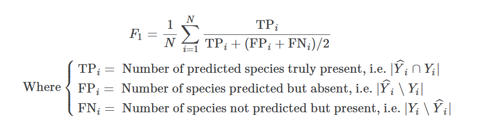

# 🌍 Location-Based Species Presence Prediction

## Overview
- **Competition Link**: [GeoLifeCLEF 2025 on Kaggle](https://www.kaggle.com/competitions/geolifeclef-2025/overview)
- **Evaluation Metric**: The evaluation metric for this competition is the samples-averaged F1-score, which measures an overlap between the predicted and actual set of species present at a given location and time.

## Problem Description
- Each test PA sample \( i \) is associated with a set of ground-truth labels Y*i*, i.e., the set of plant species (=speciesId).
- For each sample, the submission must provide a list of labels, i.e., the set of species predicted present *Y^i, 1, Y^i, 2,..., Y^i, Ri*.

## Micro F1-Score Calculation

### Timeline Proyek : https://docs.google.com/spreadsheets/d/1Zd2e_l9tSTWr4j9uxlHxnglY9LbrdvSJ8nIocYe69a8/edit?usp=sharing
